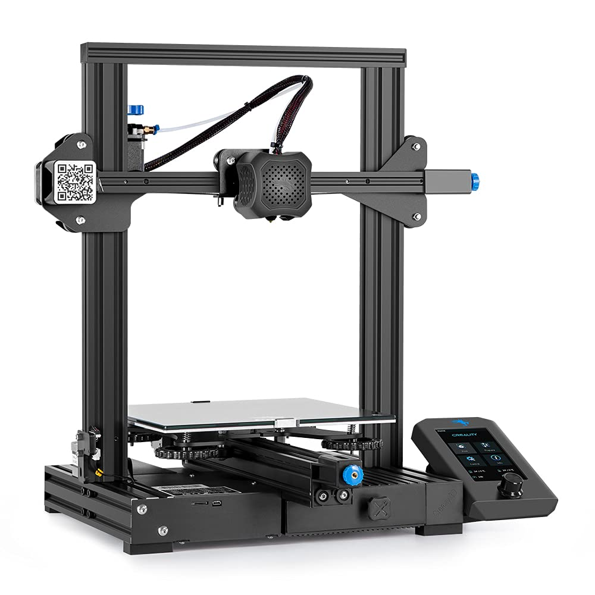

# Ender 3

<figure><figcaption>
Ender 3 V2
</figcaption></figure>

### Specs

| Spec                | Value                          |
| ------------------- | ------------------------------ |
| Modeling Technology | FDM（Fused Deposition Modeling) |
| Machine Size        | 475\*470\*620mm                |
| Printing Size       | 220x220x250mm                  |
| Filament            | PLA/TPU/PETG                   |

* Modeling Technology: FDM（Fused Deposition Modeling
* Machine size: 475\*470\*620mm
* Printing Size: 220x220x250mm
* Filament: PLA/TPU/PETG
* Working Mode: Online or SD card offline
* Supported OS: MAC/WindowsXP/7/8/10
* Filament Diameter: 1.75mm
* Slicing Software: Simplify3d/Cura
* Machine Size : 475x470x620mm
* Product Weight: 7.8KG
* Package Weight: 9.6KG
* Power Supply: Input AC 115V/230V; Output DC 24V 270W
* Layer Thickness: 0.1-0.4mm
* Print Precision: ±0.1mm
* Hotbed Temperature: ≤100°
